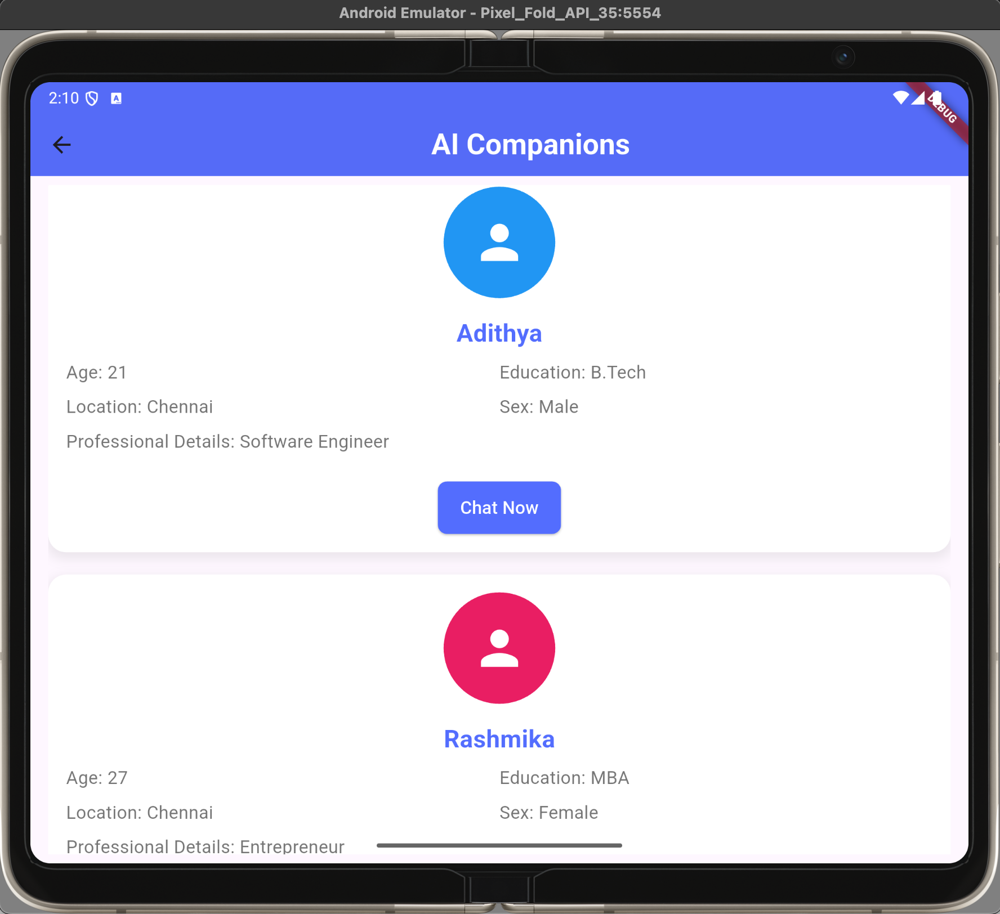

# Matchit AI - DigitalTwin - AI-Powered Conversational Companion

 An application that creates a "Digital Twin" to mimic a user's conversational style. It uses AI to respond to incoming connection requests by learning from the user's communication preferences and style. The app includes user onboarding, a personality questionnaire, and AI-driven message handling.


## Features

### Frontend (Flutter)
Onboarding Flow: User inputs personal details through an intuitive form.
Questionnaire UI: Interactive screen for answering 15 questions.
Chat Simulation: Real-time message sending and receiving interface that reflects the user’s conversational style.

### Frontend(React.js)
Admin Dashboard: View all users and their simulated conversations.

### Backend (Python FastAPI)
User Onboarding API: Store user details like name, age, location, education, and professional information.
Questionnaire API: Capture user's communication style with 15 custom questions.
Message Handling API: Generate responses to incoming messages based on the user's style using Groq AI.
Admin Dashboard API: View user details, manage questionnaire data, and monitor user interaction logs.


## Setup Instructions

### Prerequisites

1. **Flutter**: Install Flutter SDK from the [official Flutter site](https://flutter.dev/docs/get-started/install).
2. **Python**: Version 3.9 or above.
3. **PostgreSQL**: Install and configure PostgreSQL.
4. **Node.js**: Required for Flutter web support and package dependencies.

```bash
python3 -m venv venv
source venv/bin/activate  # On Windows: venv\Scripts\activate
```
```bash
cd backend
pip install -r requirements.txt
```

5. **Setup**:
```bash
touch .env
```
Update your PostgreSQL DB URL and GROQ API AI
https://console.groq.com/keys

Note: Change the IP Address 192.168.1.4 based on your system as it is dynamically assigned to enable connection between frontend and backend (Use ipconfig or ifconfig commanf to find the ip)


6. **Start the FastAPI Server**:
```bash
uvicorn main:app --reload --host 0.0.0.0 --port 8000
```
7. **Flutter Mobile Application Setup**:
```bash
cd umt_chat
flutter pub get
flutter run
```

## API Endpoints
## Users

#### Create User
```http
POST /users/

Request:
{
    "name": "string",
    "age": "integer",
    "sex": "string",
    "location": "string",
    "education": "string",
    "professional_details": "string"
}

Response:
{
    "message": "User created successfully",
    "user_id": "integer"
}
```

#### Get All Users
```http
GET /users/

Response:
[
    {
        "id": "integer",
        "name": "string",
        "age": "integer",
        "sex": "string",
        "location": "string",
        "education": "string",
        "professional_details": "string"
    }
]
```

#### Get User
```http
GET /users/{user_id}/

Response:
{
    "id": "integer",
    "name": "string",
    "age": "integer",
    "sex": "string",
    "location": "string",
    "education": "string",
    "professional_details": "string"
}
```

#### Update User
```http
PUT /users/{user_id}/

Request:
{
    "name": "string",
    "age": "integer",
    "sex": "string",
    "location": "string",
    "education": "string",
    "professional_details": "string"
}

Response:
{
    "message": "User with ID {user_id} updated successfully"
}
```

#### Delete User
```http
DELETE /users/{user_id}/

Response:
{
    "message": "User with ID {user_id} deleted successfully"
}
```

## Personality

#### Add Personality Entries
```http
POST /personality/

Request:
{
    "user_id": "integer",
    "entries": [
        {
            "user_id": "integer",
            "question": "string",
            "response": "string"
        }
    ]
}

Response:
{
    "message": "Personality entries added"
}
```

#### Delete Personality Entries
```http
DELETE /personality/{user_id}/

Response:
{
    "message": "All personality entries for user ID {user_id} deleted successfully"
}
```

## Simulation

#### Generate Response
```http
POST /simulate/

Request:
{
    "user_id": "integer",
    "message": "string"
}

Response:
{
    "response": "string"
}
```

## Flutter App Demo Screenshots

Experience a seamless onboarding process that introduces users to the app's key features


Browse and select from a diverse range of AI companions tailored to your preferences


Complete an in-depth personality assessment to create more personalized interactions


Review a comprehensive summary of your personality profile and companion preferences


Engage in natural conversations through our intuitive and responsive chat interface


## Admin Dashboard

Access a centralized dashboard to manage all user accounts and system settings


Create new user accounts with detailed profiles and customizable settings


Securely remove user accounts and associated data with confirmation safeguards


View and manage personality assessments for all users in the system


Monitor and adjust AI companion simulation parameters for optimal performance


Modify existing user profiles and settings to maintain accurate information
